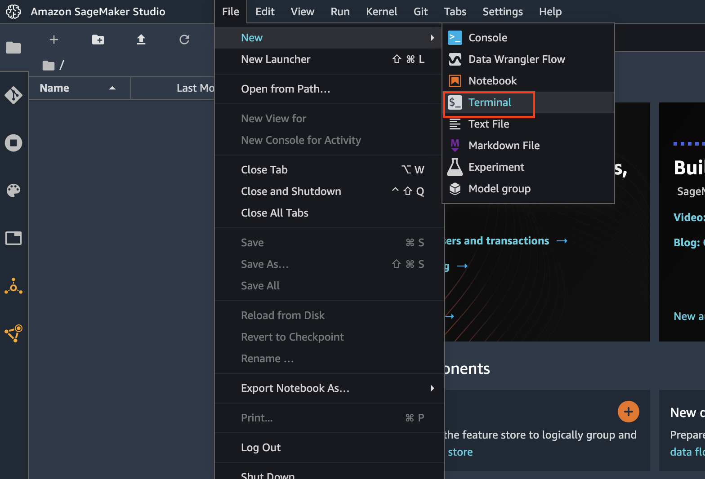

## Amazon Fraud Detector End-to-End

Amazon Fraud Detector is a fully managed service that makes it easy to identify potentially fraudulent online activities such as online payment fraud and the creation of fake accounts. This repository contains a collection of example Jupyter notebooks that interact with the Amazon Fraud Detector APIs and makes use of Amazon SageMaker Data Wrangler, Amazon Sagemaker Feature Store, and Amazon SageMaker Pipelines to-

* Clean and transform raw data
* Generate training dataset for Amazon Fraud Detector Training
* Train an Amazon Fraud Detector model
* Verify and validate model metrics and activate the model
* Create a new Amazon Fraud Detector model detector version with new rules
* Create a custom container image with necessary dependencies
* Use SageMaker pipelines to automate end to end flow

## Architecture

In this sample we will demonstrate how to operationalize Amazon Fraud Detector using SageMaker features such as SageMaker Data Wrangeler, SageMaker Feature Store, SageMaker processing jobs, and SageMaker Pipelines.

<p align="center">
  
</p>

## Getting Started

In order to be able to execute all the Jupyter Notebooks in this sample, we will first need to create a SageMaker Studio domain. The CloudFormation template to create the SageMaker Studio domain and all the related resources, such as IAM Roles, S3 Bucket etc. is included under the `/dist` directory. Follow the steps below to create the CloudFormation stack using the `sm-studio-cf.yaml` file.

> :warning: Your AWS account **must have a default VPC** for this CloudFormation template to work
> Your AWS account may also incur some nominal charges for SageMaker Studio domain. Amazon SageMaker is free to try as part of [AWS Free Tier](https://aws.amazon.com/free/). For pricing details of SageMaker Studio refer the [Amazon SageMaker pricing page](https://aws.amazon.com/sagemaker/pricing/).

* Navigate to AWS Console
* Search for CloudFormation in the Services search bar
* Once in the CloudFormation console, click on the "Create Stack" button (use the "With new resources option")
* In the "Create Stack" wizard, chose "Template is ready", then select "Upload a template file"
<p align="center">
  
</p>

* Upload the [provided](./dist/sm-studio-cf.yaml) `yaml` file, click "Next"
* In the "Specify stack details" screen, enter "Stack name". Click "Next"
<p align="center">
  
</p>

* In the "Configure Stack options" screen, leave the configurations as-is. Click "Next"
* In the "Review" screen, scroll down to the bottom of the page to the "Capabilities" section and acknowledge the notice that the stack is going to create required IAM Roles by checking the check box. Click "Create stack".
<p align="center">
  
</p>

The stack creation can take upto 30 minutes. Once your SageMaker domain is created, you can navigate to the SageMaker console and click on "Amazon SageMaker Studio" on the left pane of the screen. Choose the default user created "SageMakerUser" and Click on "Launch Studio". This will open the SageMaker Studio IDE in a new browser tab. NOTE: If this is your first time using SageMaker Studio then it may take some time for the IDE to fully launch. 
<p align="center">
  
</p>

## Setup SageMaker Studio

Once the SageMaker Studio IDE has fully loaded in your browser, you can clone this repository into the SageMaker Domain instance and start working on the provided Jupyter Notebooks. To clone this repository-

* On the SageMaker Studio IDE, click on "File menu > New > Terminal". This will open a terminal window within SageMaker Studio.
<p align="center">
  
</p>

* By default, the terminal launches at the root of the SageMaker Studio IDE workspace.
* Next, clone this repository using 

```  
git clone https://github.com/aws-samples/amazon-fraud-detector-end-to-end.git afd-end-to-end
```

<p align="center">
  
</p>

* Once the repository is cloned, a direcotry named `afd-end-to-end` will appear in the "File Browser" on the left panel of SageMaker Studio IDE
* You can now access the Jupyter Notebooks inside the directory and start working on them.
<p align="center">
  
</p>

For details about the End-to-End flow refer to the documentation within the individual Jupyter Notebooks.
## License

This library is licensed under the MIT-0 License. See the LICENSE file.